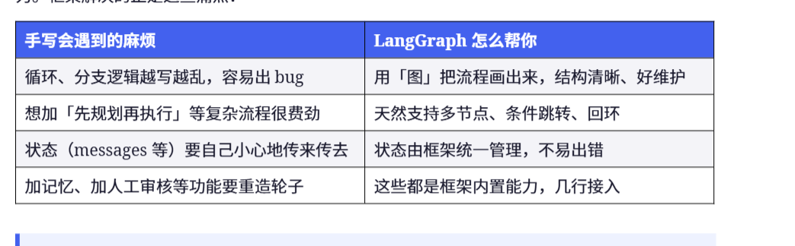
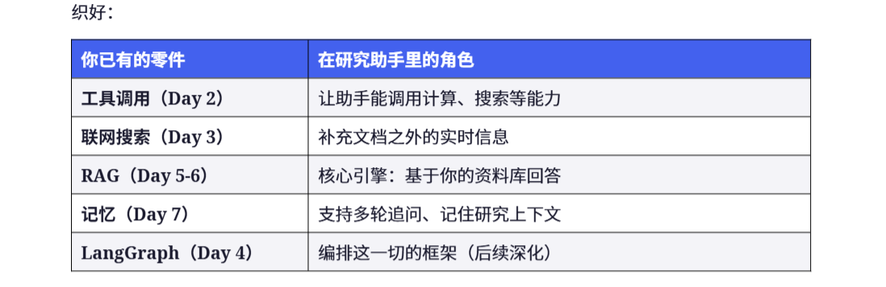
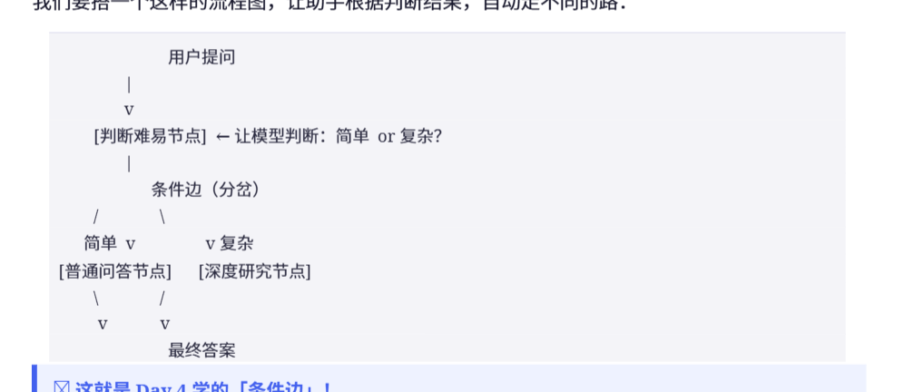
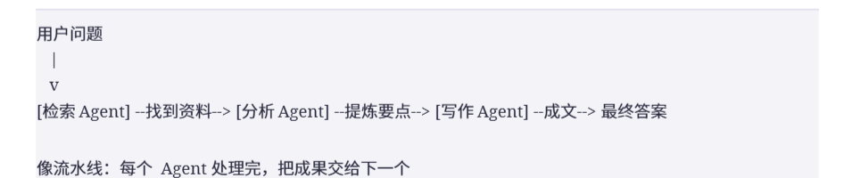
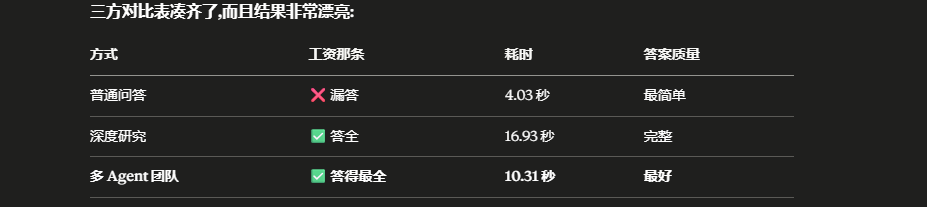
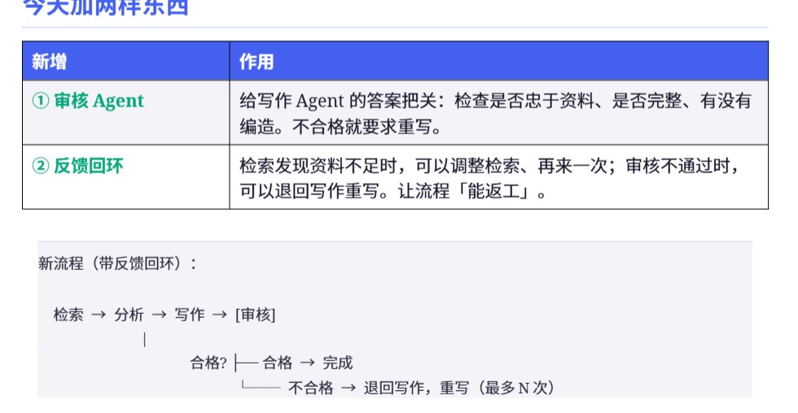
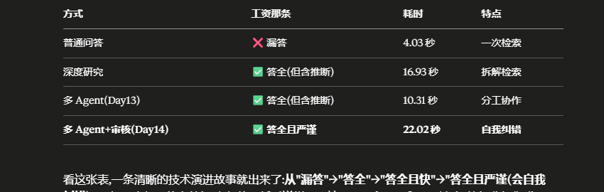
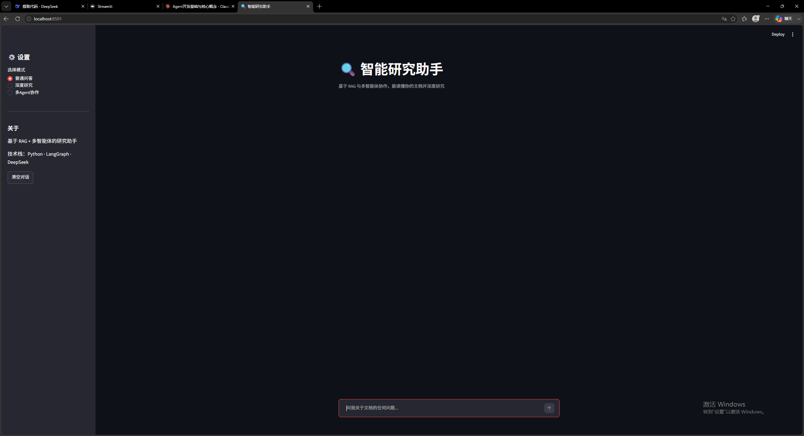
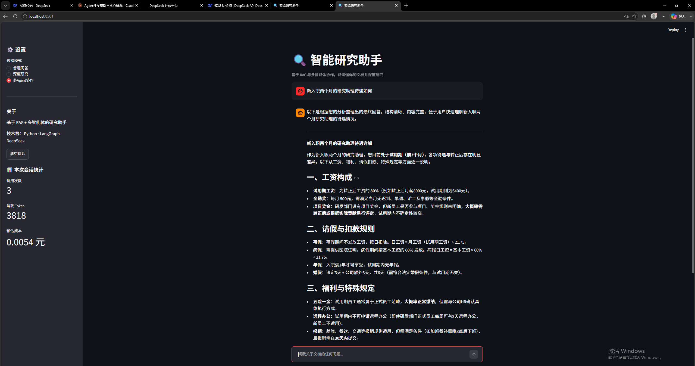

第一步：

创建虚拟环境,在vscode中termnial使用：

python -m venv .venv

接入deepseek大模型的api：

        import os
        from dotenv import load_dotenv
        from openai import OpenAI

        load_dotenv()

        # 关键：指定 DeepSeek 的地址和密钥
        client = OpenAI(
            api_key=os.getenv("DEEPSEEK_API_KEY"),
            base_url="https://api.deepseek.com"
        )

        response = client.chat.completions.create(
            model="deepseek-chat",
            max_tokens=300,
            messages=[
                {"role": "user", "content": "用一句话解释什么是 AI Agent"}
            ],
        )

        print(response.choices[0].message.content)

重点的参数理解：
        

第二天：今天做的是一个真正的agent，昨天的还是更像一个聊天机器人，比起agent，他还是用一个已经冻结的训练数据，他可能不准确，没法用最新的数据准确回答。区别是agent可以自己动手查东西拿工具啥的。

今天实施这个agent。

项目文件夹新建一个day2_agent.py

        import os
import json
from datetime import datetime
from dotenv import load_dotenv
from openai import OpenAI

load_dotenv()
client = OpenAI(
    api_key=os.getenv("DEEPSEEK_API_KEY"),
    base_url="https://api.deepseek.com"
)

# --- 工具 1：计算器 ---
def calculator(expression: str) -> str:
    """计算一个数学表达式，比如 '135 * 89'。"""
    try:
        result = eval(expression)
        return str(result)
    except Exception as e:
        return f"计算出错: {e}"

# --- 工具 2：查当前时间 ---
def get_current_time() -> str:
    """返回当前的日期和时间。"""
    return datetime.now().strftime("%Y-%m-%d %H:%M:%S")

注意这里eval会执行任何代码，实际业务开发中不要使用。

tools描述：模型不知道我写的代码，所以要用json格式介绍给他，这里叫做tools描述。 不需要有具体的代码等等，只需要给他描述基本的名字功能输入输出就可以

tools = [
    {
        "type": "function",
        "function": {
            "name": "calculator",
            "description": "计算数学表达式，当用户需要算数时使用",
            "parameters": {
                "type": "object",
                "properties": {
                    "expression": {
                        "type": "string",
                        "description": "要计算的算式，例如 '135 * 89'"
                    }
                },
                "required": ["expression"]
            }
        }
    },
    {
        "type": "function",
        "function": {
            "name": "get_current_time",
            "description": "获取当前日期和时间，当用户问现在几点、今天几号时使用",
            "parameters": {"type": "object", "properties": {}}
        }
    }
]

这里描述了一个单机的计算器功能和返回时间的功能，后续可以继续弄一些联网的工具，这样就可以返回一些需要实时搜索的东西。

写一个工具调度台：

# 名字 -> 真实函数的对照表
available_tools = {
    "calculator": calculator,
    "get_current_time": get_current_time,
}

def run_tool(name, arguments):
    """根据模型给的名字和参数，执行对应的工具。"""
    func = available_tools.get(name)
    if func is None:
        return f"找不到工具: {name}"
    # arguments 是模型给的 JSON 字符串，先转成字典
    args = json.loads(arguments)
    return func(**args)

这里的作用是把所有待用的函数传给agent，然后run_tool要求用户传入需要用的函数的名字和参数，没有的话就报错。

写一个agent主循环：

# --- Agent 主循环 ---
def run_agent(user_question):
    # messages 会不断累积：问题、模型的决定、工具的结果……
    messages = [
        {"role": "system", "content": "你是一个助手，能使用工具。需要算数或查时间时，调用对应工具。"},
        {"role": "user", "content": user_question},
    ]

    # 最多循环 5 次，防止意外死循环
    for step in range(5):
        response = client.chat.completions.create(
            model="deepseek-chat",
            messages=messages,
            tools=tools,  # 把工具清单交给模型
        )

        msg = response.choices[0].message

        # 情况 A：模型没要求用工具 -> 它直接给了答案，结束
        if not msg.tool_calls:
            return msg.content

        # 情况 B：模型要求用工具
        # 先把模型这条「我要用工具」的消息存进历史
        messages.append(msg)

        # 可能一次要用多个工具，逐个执行
        for tool_call in msg.tool_calls:
            name = tool_call.function.name
            arguments = tool_call.function.arguments
            print(f"【工具】模型决定调用：{name}，参数：{arguments}")

            result = run_tool(name, arguments)
            print(f"【结果】工具返回: {result}")

            # 把工具结果喂回给模型
            messages.append({
                "role": "tool",
                "tool_call_id": tool_call.id,
                "content": str(result),
            })

        # 循环回到开头，模型看到工具结果后继续

    return "（达到最大步数，未能得出最终答案）"

# --- 测试入口 ---
if __name__ == "__main__":
    questions = [
        "你好，你是谁？",                     # 不需要工具
        "135 乘以 89 等于多少？",            # 需要计算器
        "现在几点了？",                     # 需要时间工具
        "现在的分钟数乘以 60 是多少秒？",   # 可能连用两个工具
    ]
    for q in questions:
        print(f"\n{'-'*50}")
        print(f"提问: {q}")
        answer = run_agent(q)
        print(f"最终回答: {answer}")

开头先用role等于system设定好agent的角色，设定好的模型和能用的工具。分为三种情况，如果模型没用工具直接返回结果，没有什么特别有用的训练。如果   模型要用工具，就挨个排查每个可能用到的工具然后返回结果，然后把 结果喂给模型增加实力。

day3:今天开始实际联网搜索，用专业的搜索平台联网的需要api。

前两天已经完成了不需要调用工具模型就能自己回答的问题和本地工具的调用。今天把联网的工具也接上。

首先注册一个tavily的密钥。

已拿到密钥并放到.env里了。

开启虚拟环境并且下载tavily包：.venv\Scripts\Activate.ps1

pip install tavily-python

新建第三天的agent.py:

新定义一个联网搜索的工作：

def web_search(query: str) -> str:
    try:
        response = tavily.search(query=query, max_results=3)
        results = []
        for item in response["results"]:
            title = item["title"]
            content = item["content"]
            results.append(f"标题: {title}\n 内容: {content}")
        return "\n\n".join(results)
    except Exception as e:
        return f"搜索出错: {e}"

这个函数的功能把问题交给tavily搜索然后取回最相关的三条回复，把回复的标题和内容拼成文字还能喂给模型。

定义完新工具后确保喂给agent，让agent知道干啥的怎么用；

{
    "type": "function",
    "function": {
        "name": "web_search",
        "description": "联网搜索最新信息。当问题涉及实时、最新、或模型可能不知道的信息时使用，比如新闻、当前价格、近期事件。",
        "parameters": {
            "type": "object",
            "properties": {
                "query": {
                    "type": "string",
                    "description": "搜索关键词"
                }
            },
            "required": ["query"]
        }
    }
}

再把他追加到available tools中。

然后提问他一些需要联网搜索的问题：

            questions = [

        "最近有什么关于 AI 的重要新闻？",    # 需要联网搜索
    ]
问题在于agent搞错了搜索的方向：【工具】模型决定调用：web_search，参数：{"query": "2025年 AI 人工智能 重要新闻"}

agent搜索了2025年的新闻，肯定不对，因此我们在系统设定里加上让他知道现在哪一天的指令。

 {"role": "system", "content": f"你是一个助手，能使用工具。今天的日期是 {datetime.now().strftime('%Y年%m月%d日')}。当用户问'最近''最新'的信息时，必须调用 web_search，并在搜索词里带上当前的年份和月份，确保搜到最新内容。"}

 第四天:今天开始搭建框架，前两天写的是手写的agent，今天用框架组织起来agent。当项目大起来以后，自己手写agents就开始容易混乱和出错了，用框架更清晰好维护，添加功能也方便。好处在图里。

 

 选择的框架是langgraph。

 开始实施：
装langgraph:pip install langgraph langchain langchain-openai

新建day4文件：

初始化模型：
import os
from datetime import datetime
from dotenv import load_dotenv
from langchain_openai import ChatOpenAI
from langchain_core.tools import tool
from langgraph.prequilt import create_react_agent
from tavily import TavilyClient

load_dotenv()

# 用 ChatOpenAI 对象接入 DeepSeek（因为 DeepSeek 兼容 OpenAI 接口）
llm = ChatOpenAI(
    model="deepseek-chat",
    api_key=os.getenv("DEEPSEEK_API_KEY"),
    base_url="https://api.deepseek.com",
)

tavily = TavilyClient(api_key=os.getenv("TAVILY_API_KEY"))

用框架的好处之一就在于再也不用手动写工具的json了，用一个@tool就可以自己解析了。

@tool
def calculator(expression: str) -> str:
    """计算数学表达式，当用户需要算数时使用。expression 是算式，例如 '135 * 89'。"""
    try:
        return str(eval(expression))
    except Exception as e:
        return f"计算出错: {e}"

@tool
def get_current_time() -> str:
    """获取当前日期和时间，当用户问现在几点，今天几号时使用。"""
    return datetime.now().strftime("%Y-%m-%d %H:%M:%S")

@tool
def web_search(query: str) -> str:
    """联网搜索最新信息。涉及实时、最新信息时使用，query 是搜索关键词。"""
    try:
        response = tavily.search(query=query, max_results=3)
        results = [f"标题: {r['title']}\n 内容: {r['content']}" for r in response["results"]]
        return "\n\n".join(results)
    except Exception as e:
        return f"搜索出错: {e}"

前几天写的那个大循环用框架只需要一两行就完事

现在问问题通过message：

if __name__ == "__main__":
    today = datetime.now().strftime("%Y年%m月%d日")
    questions = [
    "135 乘以 89 等于多少？",
    "现在几点了？",
    "请搜索最新消息，最近有什么重要的 AI 新闻？",
    ]
for q in questions:
    print(f"\n{'='*50}")
    print(f"提问: {q}")
    # 把当前日期放进 system 提示，避免它搜错年份（Day 3 学到的教训）
    result = agent.invoke({
    "messages": [
    ("system", f"今天是 {today}。查最新信息时，搜索词要带上当前年月。"),
    ("user", q),
    ]
    })
    # 最终回答在 messages 列表的最后一条

print(f"最终回答: {result['messages'][-1].content}")

第五天：今天的重点是引入RAG。为什么要引入rag:现在模型训练主要有两个知识来源，第一个是引入的api来原里训练好的数据，另一个是联网公开搜索能找到的数据。可是这两种来源都有一个没法解决的问题：自定义的一些私有的从来没上传到网上的资料。

引入RAG的目的就在于让agent在回答之前先在我给的材料里检索。不是说模型要死记硬背这些内容，而是说有用到的时候检索搜索，找到需要的内容就好。

RAG的流程分为三档：

1：把用户的资料切割成小向量存储到向量库中；
2：把用户的问题也切分成向量，
3：把用户的问题和相关的文档一块给模型让模型回答。

核心概念：
向量：把文字转为数字，文字意思相近转成向量后数字也相近，所以比较文字意思像不像就变成比数字接近不，计算机很擅长比数字算的也很快，

向量库：存放向量且能快速找到近似向量的库。

切块：为了检索更精准返回的时候也不要返回长篇大论啥的。

开始：先安装chromadb，就是上文提到的向量库。

准备一份网上没有的虚拟公司制度文档：

以下是提取的文字内容：

---

**光速科技公司员工手册（内部资料）**

**一、考勤制度**

员工每天工作时间为上午9点到下午6点，午休一小时。

每月可申请两次远程办公，需提前一天报备。

**二、报销制度**

差旅报销上限为每天500元，需保留发票。

报销申请需在消费后15天内提交，逾期不予受理。

**三、年假制度**

入职满一年享有5天年假，满三年享有10天年假。

年假需提前三天申请，旺季（每年11月）原则上不批假。

完成rag的准备阶段：准备阶段分为四步

先加载文章，切成小块，进行embedding并存入向量库。

import os
from dotenv import load_dotenv
from langchain_community.document_loaders import TextLoader
from langchain_text_splitters import RecursiveCharacterTextSplitter
from langchain_community.vectorstores import Chroma
from langchain_core.embeddings import Embeddings
from zhipuai import ZhipuAI

load_dotenv()

# 用智谱的 embedding（纯 API，不需要 torch）
class ZhipuEmbeddings(Embeddings):
    def __init__(self):
        self.client = ZhipuAI(api_key=os.getenv("ZHIPU_API_KEY"))

    def _embed(self, text):
        resp = self.client.embeddings.create(
            model="embedding-3",
            input=text,
        )
        return resp.data[0].embedding

    def embed_documents(self, texts):
        return [self._embed(t) for t in texts]

    def embed_query(self, text):
        return self._embed(text)

# 1) 读取文档
loader = TextLoader("my_doc.txt", encoding="utf-8")
documents = loader.load()

# 2) 把文档切成小块
splitter = RecursiveCharacterTextSplitter(
    chunk_size=100,
    chunk_overlap=20,
)
chunks = splitter.split_documents(documents)
print(f"文档被切成了 {len(chunks)} 块")

# 3) 准备 embedding 模型（智谱）
embeddings = ZhipuEmbeddings()

Embedding算法用的智谱。

出了条问题，chroma用不了，先手动算相似度，等会再换。

第六天：今天改良RAG的情况。昨天提问时候发现一个问题就是切块切的不好导致agent没找到适合的那一块回答出了一个不对的答案。今天学习怎么切块。

RAG有三个主要的参数：chunk_size：每块切多大，chunk overlap：两块中间保留多少相邻的，这样可以保留一些上下文不至于一刀切。k：检索的时候拿几块向量。

所以可以调参数试试：

把切块的size调大，overlap调大和k调大。

这样搜索确实能找到东西但是发现了另一个问题，agent没有做出入职两年适用于1年年假的合理推测，太过死板，可以在提示词了改一下。

prompt = f"""请根据下面的资料回答问题。

规则：
1. 如果资料里有可以推断出答案的信息，请做出合理推断。例如资料说"满一年享有5天"，那么"入职两年"也适用这一档，应回答5天。
2. 只有当资料里完全没有相关信息时，才说"资料里没有提到"。

资料：
{context}

问题：{question}"""

加新功能：读pdf的不止txt。

先装包然后只需要把loader从txt改成pdf其他的一样用没问题。

第七天：今天主要是把agent的记忆加上。本质上agent是没有记忆的，只不过是把以前的message重新调用。前几天append message就是这个目的。
今天把以前的信息塞到rag的向量库里。

概念理解:AI本质上是没有记忆的，当与大语言模型对话的时候看起来有记忆是因为把以前的对话记录信息啥的一块合并发给ai了，是ai的短期记忆。

ai的记忆分为短期和长期记忆。短期就是刚才说的把消息一块发回来，下次再发新的就没有了，容易超出context上限。

长期记忆就是存储到向量库能记住更多关于用户偏好等内容，但是需要额外存储和检索机制。

开始：新建day7_memory.py。

import os
from dotenv import load_dotenv
from openai import OpenAI

load_dotenv()
client = OpenAI(
    api_key=os.getenv("DEEPSEEK_API_KEY"),
    base_url="https://api.deepseek.com",
)

# 这个列表就是「短期记忆」——它会累积整场对话
messages = [
    {"role": "system", "content": "你是一个友好的助手。"}
]

def chat(user_input):
    # 1) 把用户这句话加进记忆
    messages.append({"role": "user", "content": user_input})

    # 2) 把「整个记忆」发给模型（关键：带上全部历史）
    response = client.chat.completions.create(
        model="deepseek-chat",
        messages=messages,
    )
    reply = response.choices[0].message.content

    # 3) 把模型的回复也加进记忆（这样下一轮它才记得自己说过什么）
    messages.append({"role": "assistant", "content": reply})
    return reply

# 做一个「连续对话」测试
if __name__ == "__main__":
    print(chat("你好，我叫小明，我最喜欢的颜色是蓝色。"))
    print(chat("我叫什么名字？"))  # 它应该记得「小明」
    print(chat("我喜欢什么颜色？"))  # 它应该记得「蓝色」

可以看到这个代码每次都会把user的input和reply同时添加到messages里面然后下次chat会把整个message发给模型。

联系对话：if __name__ == "__main__":
    print("开始聊天吧！输入 quit 退出。")
    while True:
        user_input = input("你：")
        if user_input.strip().lower() == "quit":
            print("再见！")
            break
        reply = chat(user_input)
        print("助手：", reply)

接入长期记忆：刚才的短期记忆确实管用但是问题在于每次新对话都得把相关信息喂给ai，而且对话时间长了内容多了messages太长也容易忘记。所以要接入长期记忆。

from zhupuai import ZhipuAI  # 注意：库名可能是 zhipuai，原代码有拼写错误，但按原样保留

zhipu = ZhipuAI(api_key=os.getenv("ZHIPU_API_KEY"))

def embed(text):
    resp = zhipu.embeddings.create(model="embedding-3", input=text)
    return resp.data[0].embedding

def cosine_similarity(a, b):
    dot = sum(x * y for x, y in zip(a, b))
    na = sum(x * x for x in a) ** 0.5
    nb = sum(y * y for y in b) ** 0.5
    return dot / (na * nb)

# 长期记忆库（每条记忆连同它的向量一起存）
long_term_memory = []

def remember(fact):
    """把一条重要信息存进长期记忆。"""
    long_term_memory.append({"text": fact, "vector": embed(fact)})
    print(f"【记住】{fact}")

def recall(query, k=2):
    """根据当前问题，检索最相关的记忆。"""
    if not long_term_memory:
        return []

    q_vec = embed(query)
    scored = [(cosine_similarity(q_vec, m["vector"]), m["text"]) for m in long_term_memory]
    scored.sort(reverse=True)
    return [text for score, text in scored[:k]]

把重要信息存进记忆库，根据相似度算法检索相关算法然后recall根据相似度返回。

def chat_with_memory(user_input):
    # 1) 先从长期记忆里回忆相关内容
    memories = recall(user_input, k=2)
    memory_text = "\n".join(memories) if memories else "（暂无相关记忆）"

    # 2) 把回忆到的内容放进 system 提示
    system_prompt = f"你是一个友好的助手。以下是你记得的关于用户的信息：\n{memory_text}"

    msgs = [
        {"role": "system", "content": system_prompt},
        {"role": "user", "content": user_input},
    ]
    reply = client.chat.completions.create(model="deepseek-chat", messages=msgs)
    return reply.choices[0].message.content

if __name__ == "__main__":
    # 先手动存几条长期记忆
    remember("用户的名字是小明")
    remember("用户是一名正在学习 AI 的学生")
    remember("用户喜欢喝美式咖啡")

    # 就算是全新的对话（没有短期记忆），它也能靠长期记忆回答
    print(chat_with_memory("我叫什么名字？"))      # 靠长期记忆答出小明
    print(chat_with_memory("推荐一款适合我的饮料"))  # 靠记忆知道他爱美式
虽然长期记忆和短期记忆工作原理都挺相似就是把东西喂给ai，但是有个关键点在于短期记忆全喂，长期记忆只挑关键的。你看chat_with_memory这个功能上来先根据user_input回忆相关的向量，所以是根据相关的内容选择性放进记忆里，并不是说非常的吃上下文。

第八天：今天的重点在于结构重组将代码的结构整的更清晰一些，比如分离出config，loader等以后想改切块参数直接改config这样的道理。今天结束同时也有处理多个文档的能力开始像一个整机了。

现有文件：

开始：结构重组：

research_assistant/
├── config.py          # 配置：模型、密钥、参数集中管理
├── loader.py          # 文档加载与清洗
├── rag.py             # 向量化、检索（RAG 核心）
├── assistant.py       # 主逻辑：把检索+记忆+回答串起来
├── main.py            # 程序入口，运行它开始使用
└── documents/         # 放你的资料文档（多个文件）

# config.py
import os
from dotenv import load_dotenv

load_dotenv()

# DeepSeek：对话大模型
DEEPSEEK_API_KEY = os.getenv("DEEPSEEK_API_KEY")
DEEPSEEK_BASE_URL = "https://api.deepseek.com"
CHAT_MODEL = "deepseek-chat"

# 智谱：embedding
ZHIPU_API_KEY = os.getenv("ZHIPU_API_KEY")
EMBED_MODEL = "embedding-3"

# Tavily：联网搜索
TAVILY_API_KEY = os.getenv("TAVILY_API_KEY")

# RAG 参数
CHUNK_SIZE = 300
CHUNK_OVERLAP = 50
TOP_K = 4

# 文档目录
DOCUMENTS_DIR = "documents"
这样以后不管在哪里调试只需要在config.py里的参数改了就行然后统一调用，更清晰和可维护。

再建造一个loader.py,包括读取txt，pdf，和清洗杂志，也是工程化步骤的一部分。

### 3.1 一次加载整个文件夹的文档

import os
from langchain_community.document_loaders import TextLoader, PyPDFLoader

def load_all_documents(folder):
    """读取文件夹里所有 txt 和 pdf 文档。"""
    all_docs = []
    for filename in os.listdir(folder):
        path = os.path.join(folder, filename)
        if filename.endswith(".txt"):
            docs = TextLoader(path, encoding="utf-8").load()
        elif filename.endswith(".pdf"):
            docs = PyPDFLoader(path).load()
        else:
            continue  # 跳过不支持的格式
        all_docs.extend(docs)
        print(f"已加载: {filename} ({len(docs)} 段)")
    return all_docs

### 3.2 清洗文档杂质

def clean_text(text):
    """清洗文档里的杂质。"""
    # 去掉一些已知的干扰语句（按你的实际情况补充）
    junk_phrases = ["以下是提取的文字内容：", "--"]
    for junk in junk_phrases:
        text = text.replace(junk, "")
    # 把连续的多个空行压成一个
    lines = [line.strip() for line in text.split("\n") if line.strip()]
    return "\n".join(lines)

rag.py:

# rag.py
from zhipuai import ZhipuAI
from langchain_text_splitters import RecursiveCharacterTextSplitter
import config

zhipu = ZhipuAI(api_key=config.ZHIPU_API_KEY)

# 知识库：存每个文档块和它的向量
knowledge_base = []

def embed(text):
    """把文字转成向量。"""
    resp = zhipu.embeddings.create(model=config.EMBED_MODEL, input=text)
    return resp.data[0].embedding

def cosine_similarity(a, b):
    """计算两个向量的相似度。"""
    dot = sum(x * y for x, y in zip(a, b))
    na = sum(x * x for x in a) ** 0.5
    nb = sum(y * y for y in b) ** 0.5
    return dot / (na * nb)

def build_knowledge_base(documents):
    """把文档切块、向量化，建立知识库。"""
    splitter = RecursiveCharacterTextSplitter(
        chunk_size=config.CHUNK_SIZE,
        chunk_overlap=config.CHUNK_OVERLAP,
    )
    chunks = splitter.split_documents(documents)
    print(f"文档被切成了 {len(chunks)} 块，正在向量化...")

    knowledge_base.clear()
    for c in chunks:
        vec = embed(c.page_content)
        knowledge_base.append({"text": c.page_content, "vector": vec})
    print(f"知识库就绪，共 {len(knowledge_base)} 块。")

def search(query, k=None):
    """检索最相关的 k 个文档块。"""
    if k is None:
        k = config.TOP_K
    if not knowledge_base:
        return []
    q_vec = embed(query)
    scored = [(cosine_similarity(q_vec, item["vector"]), item["text"])
              for item in knowledge_base]
    scored.sort(reverse=True)
    return [text for score, text in scored[:k]]

assistant.py:

# assistant.py
from openai import OpenAI
import config
from rag import search

client = OpenAI(
    api_key=config.DEEPSEEK_API_KEY,
    base_url=config.DEEPSEEK_BASE_URL,
)

def answer(question):
    """基于知识库回答问题。"""
    # 1) 检索相关内容
    docs = search(question)
    context = "\n".join(docs) if docs else "（没有检索到相关资料）"

    # 2) 拼提示词
    prompt = f"""请根据下面的资料回答问题。

规则：
1. 如果资料里有可以推断出答案的信息，请做出合理推断。
2. 只有当资料里完全没有相关信息时，才说"资料里没有提到"。

资料：
{context}

问题：{question}"""

    # 3) 让模型作答
    response = client.chat.completions.create(
        model=config.CHAT_MODEL,
        messages=[{"role": "user", "content": prompt}],
    )
    return response.choices[0].message.content

这个assistant.py是检索文档作出回答，有就回答，没有就说没有。

第九天：今天主要目的是让助手学会拆解任务多步推理，让agent自己把大任务拆成小步骤，逐个解决再汇总。原来是一问一答，现在让助手有一定的自主性主动查资料分析对比总结等。

为什么一问一答不够？：因为有些问题涉及多领域的比较不同相同，所以如果只能一问一答不拆解的话很难回答上来。比如对比一下文档里远程办公和年假的规定有什么不同和相同。这种问题如果不能拆解的话，直接拿这句话检索那他就不会，除非原文中明确指出。所以必须要学会拆解。

例子：
星海科技公司管理制度汇编

第一章 考勤与工作时间
公司实行弹性工作制。核心工作时间为上午10点至下午4点，员工需在此时段在岗。
每日标准工作时长为8小时，可在早7点至晚8点之间自行安排。
迟到超过30分钟记为半天事假。每月迟到累计超过3次，取消当月全勤奖。
全勤奖为每月500元。

第二章 远程办公
研发部门员工每周最多可远程办公2天，需提前一天在系统申请。
市场部门员工每周最多可远程办公1天。
新入职员工在试用期内（前3个月）不可申请远程办公。
远程办公当天须保证在核心工作时间内在线响应。

第三章 请假制度
事假：需提前1天申请，事假期间不发放工资。
病假：需提供医院证明，病假工资按基本工资的60%发放。
年假：入职满1年享有5天年假，满3年享有10天年假，满5年享有15天年假。
婚假：法定婚假3天，公司额外补贴3天，共6天。

第四章 薪酬与福利
工资于每月10日发放。
研发部门有项目奖金，市场部门有销售提成。
公司为所有正式员工缴纳五险一金。
试用期员工工资为转正后的80%。

第五章 报销制度
差旅报销：一线城市每天上限800元，其他城市每天上限500元。
餐饮报销：加班餐补每次30元，需晚上8点后下班。
报销需在消费后30天内提交，附发票原件。
交通报销：市内交通实报实销，需提供打车或公交记录。

第六章 培训与发展
新员工入职需完成为期1周的岗前培训。
公司每年为每位员工提供2000元培训经费。
研发人员可申请参加技术会议，费用由公司承担。
员工完成外部认证考试并通过的，公司报销考试费用。

第七章 离职规定
正式员工离职需提前30天书面通知。
试用期员工离职需提前3天通知。
离职时须完成工作交接并归还公司财物。
未休完的年假，离职时按比例折算为工资补偿。

这个长文本问他以下问题：一个入职 2 个月的研发新人,能远程办公吗?他的工资是多少?能休年假吗，他漏答工资为百分之八十。

大模型拆解问题的过程：规划，执行汇总。

第一阶段：规划（Plan）

让模型先把大问题拆成几个小问题。例如：
大问题：对比远程办公和年假的规定
拆成 → 1. 远程办公有哪些规定？
    2. 年假有哪些规定？
    3. 它们有什么异同？

第二阶段：执行（Execute）

对每个小问题，分别做 RAG 检索+回答，得到中间结果

第三阶段：汇总（Synthesize）

把所有中间结果交给模型，让它综合成最终答案

第一步：计划：

import json
from openai import OpenAI
import config

client = OpenAI(
    api_key=config.DEEPSEEK_API_KEY,
    base_url=config.DEEPSEEK_BASE_URL,
)

def plan(question):
    """把一个复杂问题拆成几个子问题。"""
    prompt = f"""请把下面这个复杂问题，拆解成 2-4 个更小、更具体的子问题，
    以便逐个查资料回答。只输出一个 JSON 数组，例如 ['子问题 1', '子问题 2']，不要有别的文字。

复杂问题: {question}"""

    response = client.chat.completions.create(
        model=config.CHAT_MODEL,
        messages=[{"role": "user", "content": prompt}],
    )
    text = response.choices[0].message.content.strip()
    # 模型有时会用 `json` 包裹，去掉它
    text = text.replace("`json`", "").replace("`", "").strip()
    try:
        return json.loads(text)  # 转成 Python 列表
    except Exception:
        return [question]  # 万一解析失败，就当作单个问题处理

调用大模型的推理能力把这个大问题拆成几个小问题。

from planner import plan

def deep_research(question):
    """面对复杂问题：拆解 -> 逐个回答 -> 汇总。"""
    # 第一阶段：规划
    sub_questions = plan(question)
    print(f"\n【规划】把问题拆成了 {len(sub_questions)} 个子问题：")
    for i, sq in enumerate(sub_questions, 1):
        print(f" {i}. {sq}")

    # 第二阶段：逐个执行（每个子问题都走一遍 RAG）
    findings = []
    for sq in sub_questions:
        print(f"\n【执行】正在研究：{sq}")
        sub_answer = answer(sq)  # 复用你的单问题 RAG 问答
        findings.append(f"子问题：{sq}\n 发现：{sub_answer}")

    # 第三阶段：汇总
    print("\n【汇总】正在综合所有发现...")
    combined = "\n\n".join(findings)
    synth_prompt = f"""以下是针对一个复杂问题，分步研究得到的发现。
请综合这些发现，给出一个完整、有条理的最终回答。

原始问题：{question}

分步发现：
{combined}"""

    final = client.chat.completions.create(
        model=config.CHAT_MODEL,
        messages=[{"role": "user", "content": synth_prompt}],
    )
    return final.choices[0].message.content
先调用planner里面的plan把问题分成几个小questions，然后再分别调用rag系统分别回答最后join成一个大回答，然后prompt里改成加上你需要根据这些分开的回答总结。

带开关的main.py可选择深度还是普通回答。

# main.py
import time
import config
from loader import load_all_documents, clean_text
from rag import build_knowledge_base
from assistant import answer, deep_research

def main():
    # 1) 加载并清洗文档
    print("正在加载文档...")
    docs = load_all_documents(config.DOCUMENTS_DIR)
    for d in docs:
        d.page_content = clean_text(d.page_content)

    # 2) 建立知识库
    build_knowledge_base(docs)

    # 3) 选择模式
    print("\n" + "=" * 50)
    print("知识库就绪！请选择模式：")
    print("  1 = 普通问答（一步检索，速度快）")
    print("  2 = 深度研究（拆解任务，多步推理）")
    mode = input("输入 1 或 2：").strip()

    if mode == "2":
        ask_func = deep_research
        mode_name = "深度研究"
    else:
        ask_func = answer
        mode_name = "普通问答"
    print(f"\n已进入【{mode_name}】模式。输入 quit 退出，输入 switch 切换模式。\n")

    # 4) 交互式问答
    while True:
        q = input("\n你的问题：").strip()

        if q.lower() == "quit":
            print("再见！")
            break

        # 支持中途切换模式
        if q.lower() == "switch":
            if ask_func == answer:
                ask_func = deep_research
                mode_name = "深度研究"
            else:
                ask_func = answer
                mode_name = "普通问答"
            print(f"已切换到【{mode_name}】模式。")
            continue

        if not q:
            continue

        # 计时并回答
        start = time.time()
        ans = ask_func(q)
        elapsed = time.time() - start

        print(f"\n{'=' * 50}")
        print(f"【{mode_name}】回答：\n{ans}")
        print(f"[耗时 {elapsed:.2f} 秒]")

if __name__ == "__main__":
    main()

深浅思考对比图：

【实验记录：任务拆解对复杂问题回答完整度的影响】

测试环境：知识库 17 个文本块，TOP_K=4，DeepSeek + 智谱embedding
测试问题：「入职2个月的研发新人，能远程办公吗？工资多少？能休年假吗？」
（该问题所需信息横跨文档第二、三、四章）

对比结果：
┌──────────┬──────────┬──────────┬─────────┐
│ 模式      │ 远程办公  │ 工资      │ 年假     │ 耗时
├──────────┼──────────┼──────────┼─────────┤
│ 普通问答  │ ✅答对   │ ❌漏答    │ ✅答对   │ 4.03s
│ 深度研究  │ ✅答对   │ ✅答对    │ ✅答对   │ 16.93s
└──────────┴──────────┴──────────┴─────────┘

关键结论：
- 普通问答单次检索(4块)无法覆盖跨3个章节的信息，
  遗漏了"试用期工资=转正80%"这一关键条款。
- 深度研究通过任务拆解，让"工资"子问题获得独立检索，
  成功命中该条款，回答完整度从 2/3 提升至 3/3。
- 代价：耗时从 4s 增至 17s（约4倍）——这是"深度换时间"的取舍。

第十天：今天的工作重点是给研究助手接上短期记忆。研究助手的性质决定它更适合加短期记忆，长期记忆比如用户偏好啥的没那么相关。

开始：
新建一个memory.py,保留最近的10turn 20 条聊天记录：

class ConversationMemory:
    """管理多轮对话的短期记忆。"""
    def __init__(self, max_turns=10):
        self.history = []  # 存对话历史
        self.max_turns = max_turns  # 最多保留多少轮，防止太长

    def add(self, role, content):
        """添加一条消息（role 是 user 或 assistant）。"""
        self.history.append({"role": role, "content": content})
        # 如果太长，只保留最近的 max_turns*2 条（一问一答算两条）
        if len(self.history) > self.max_turns * 2:
            self.history = self.history[-self.max_turns * 2:]

    def get(self):
        """取出全部历史，用于拼进请求。"""
        return self.history

    def clear(self):
        """清空记忆（开始新话题时用）。"""
        self.history = []

修改assistant.py加上短期记忆：

# assistant.py
from openai import OpenAI
import config
from rag import search
from planner import plan

client = OpenAI(
    api_key=config.DEEPSEEK_API_KEY,
    base_url=config.DEEPSEEK_BASE_URL,
)

# ========== 普通问答（带记忆） ==========
def answer(question, memory=None):
    """基于知识库回答问题，可选带对话记忆。"""
    # 1) RAG 检索
    docs = search(question)
    context = "\n".join(docs) if docs else "（没有检索到相关资料）"

    # 2) 组装 messages：系统提示 + 历史记忆 + 当前问题
    messages = [
        {"role": "system", "content": "你是一个研究助手，根据提供的资料回答问题。"
                                      "如果资料里能推断出答案，请合理推断；"
                                      "只有完全没有相关信息时，才说'资料里没有提到'。"},
    ]
    if memory is not None:
        messages += memory.get()   # 把对话历史加进来

    # 当前问题（带上检索到的资料）
    user_msg = f"资料：\n{context}\n\n问题：{question}"
    messages.append({"role": "user", "content": user_msg})

    # 3) 调模型
    response = client.chat.completions.create(
        model=config.CHAT_MODEL,
        messages=messages,
    )
    reply = response.choices[0].message.content

    # 4) 把这一轮存进记忆（只存原始问题，不存冗长的资料）
    if memory is not None:
        memory.add("user", question)
        memory.add("assistant", reply)

    return reply

# ========== 深度研究（拆解 → 逐个执行 → 汇总） ==========
def deep_research(question, memory=None):
    """面对复杂问题：拆解 -> 逐个回答 -> 汇总。可选带记忆。"""
    # 第一阶段：规划
    sub_questions = plan(question)
    print(f"\n【规划】把问题拆成了 {len(sub_questions)} 个子问题：")
    for i, sq in enumerate(sub_questions, 1):
        print(f"  {i}. {sq}")

    # 第二阶段：逐个执行（子问题不带记忆，避免互相干扰）
    findings = []
    for sq in sub_questions:
        print(f"\n【执行】正在研究：{sq}")
        sub_answer = answer(sq)   # 子问题独立检索回答，不传 memory
        findings.append(f"子问题：{sq}\n发现：{sub_answer}")

    # 第三阶段：汇总
    print("\n【汇总】正在综合所有发现...")
    combined = "\n\n".join(findings)

    # 汇总时，把对话历史也带上，让它理解当前研究的上下文
    messages = [
        {"role": "system", "content": "你是一个研究助手，善于综合分步研究的发现，给出完整有条理的回答。"},
    ]
    if memory is not None:
        messages += memory.get()

    synth_prompt = f"""以下是针对一个复杂问题，分步研究得到的发现。
请综合这些发现，给出一个完整、有条理的最终回答。不要重复啰嗦。

原始问题：{question}

分步发现：
{combined}"""
    messages.append({"role": "user", "content": synth_prompt})

    final = client.chat.completions.create(
        model=config.CHAT_MODEL,
        messages=messages,
    )
    result = final.choices[0].message.content

    # 把这轮深度研究也存进记忆
    if memory is not None:
        memory.add("user", question)
        memory.add("assistant", result)

    return result

main改造，加记忆：

# main.py
import time
import config
from loader import load_all_documents, clean_text
from rag import build_knowledge_base
from assistant import answer, deep_research
from memory import ConversationMemory

def main():
    # 1) 加载并清洗文档
    print("正在加载文档...")
    docs = load_all_documents(config.DOCUMENTS_DIR)
    for d in docs:
        d.page_content = clean_text(d.page_content)

    # 2) 建立知识库
    build_knowledge_base(docs)

    # 3) 创建对话记忆
    memory = ConversationMemory(max_turns=10)

    # 4) 选择模式
    print("\n" + "=" * 50)
    print("研究助手就绪！请选择模式：")
    print("  1 = 普通问答（一步检索，速度快）")
    print("  2 = 深度研究（拆解任务，多步推理）")
    mode = input("输入 1 或 2：").strip()

    if mode == "2":
        ask_func = deep_research
        mode_name = "深度研究"
    else:
        ask_func = answer
        mode_name = "普通问答"

    print(f"\n已进入【{mode_name}】模式。")
    print("命令：quit=退出  switch=切换模式  new=清空记忆开始新话题\n")

    # 5) 交互式问答
    while True:
        q = input("\n你的问题：").strip()

        if q.lower() == "quit":
            print("再见！")
            break

        if q.lower() == "switch":
            if ask_func == answer:
                ask_func = deep_research
                mode_name = "深度研究"
            else:
                ask_func = answer
                mode_name = "普通问答"
            print(f"已切换到【{mode_name}】模式。")
            continue

        if q.lower() == "new":
            memory.clear()
            print("已开始新话题，记忆已清空。")
            continue

        if not q:
            continue

        # 计时并回答（两种模式都传入记忆）
        start = time.time()
        ans = ask_func(q, memory=memory)
        elapsed = time.time() - start

        print(f"\n{'=' * 50}")
        print(f"【{mode_name}】回答：\n{ans}")
        print(f"[耗时 {elapsed:.2f} 秒]")

if __name__ == "__main__":
    main()

DAY11:今天让agent拥有自我分析的能力，难的问题仔细思考，简单的问题脱口而出。用langgraph的条件分支。

用上第四天学过的条件边和节点。判断难易是节点，判断完后往哪走是条件边。

开始：在planner.py里加一个判断难度的函数

def judge_complexity(question):
    """判断问题是简单还是复杂。返回 'simple' 或 'complex'。"""
    prompt = f"""判断下面这个问题是「简单」还是「复杂」。\n
    简单：能一步查到答案的单一问题（如差旅费多少钱）。\n
    复杂：需要对比、综合多个方面、或跨多个主题的问题（如对比 A 和 B 的异同）。\n
    只回答一个词：simple 或 complex，不要有别的回答。

问题: {question}"""

    response = client.chat.completions.create(
        model=config.CHAT_MODEL,
        messages=[{"role": "user", "content": prompt}],
    )
    result = response.choices[0].message.content.strip().lower()
    # 兜底：只要包含 complex 就算复杂，否则简单
    return "complex" if "complex" in result else "simple"

利用大模型的调用判断是复杂还是简单直接返回一个变量。

新建graph.py:

from typing import TypedDict
from langgraph.graph import StateGraph, END
from planner import judge_complexity
from assistant import answer, deep_research

# 定义在图里流转的「状态」
class State(TypedDict):
    question: str  # 用户问题
    complexity: str  # 难易判断结果
    result: str  # 最终答案

# 节点1：判断难易
def route_node(state):
    level = judge_complexity(state["question"])
    print(f"【路由】判断为：{level}")
    return {"complexity": level}

# 节点2：普通问答
def simple_node(state):
    result = answer(state["question"])
    return {"result": result}

# 节点3：深度研究
def complex_node(state):
    result = deep_research(state["question"])
    return {"result": result}

def decide_route(state):
    if state["complexity"] == "complex":
        return "complex"  # 去深度研究节点
    else:
        return "simple"  # 去普通问答节点

## 2.4 把节点和边组装成图

# 创建图
graph = StateGraph(State)

# 加入三个节点
graph.add_node("route", route_node)
graph.add_node("simple", simple_node)
graph.add_node("complex", complex_node)

# 设置入口：先进 route 节点判断
graph.set_entry_point("route")

# 条件边：route 判断后，按 decide_route 的返回值分流
graph.add_conditional_edges("route", decide_route, {
    "simple": "simple",  # 返回 simple → 去 simple 节点
    "complex": "complex",  # 返回 complex → 去 complex 节点
})

# 两个执行节点做完就结束
graph.add_edge("simple", END)
graph.add_edge("complex", END)

# 编译成可运行的应用
app = graph.compile()

这个整个过程就是先定义一个状态包括用户问题，难易程度判断，和最终结果。节点一判断难易，节点二是普通问答，节点三深度研究。还有一个判断route的功能，吃一个state进来，如果是complex去复杂反之去普通。

用户提问 → route判断 → 分岔 → simple 或 complex → 结束

结尾add edge 无论是simple还是complex都去end。

第十二天：现在的基本功能还算是比较齐全，但是问题也很明显，没有一些保护措施导致现在的agent很脆。今天要做的就是加入一些防护机制主要分为三种，重试超时兜底。

重试为了解决偶尔的api崩盘问题，超市就是避免超长的不合理的等待时间，兜底就是避免出错了直接崩盘。

开始：给请求加重试和超时：
import time

def retry(func, max_attempts=3, delay=2):
    """重试执行一个函数，失败就等一会儿再试，最多 max_attempts 次。"""
    for attempt in range(1, max_attempts + 1):
        try:
            return func()  # 尝试执行
        except Exception as e:
            print(f"【重试】第 {attempt} 次失败: {e}")
            if attempt < max_attempts:
                time.sleep(delay)  # 等一会儿再试
            else:
                print(f"【重试】多次失败，放弃。")
                raise  # 试到最后还没失败，才真正报错
重试

client = OpenAI(
    api_key=config.DEEPSEEK_API_KEY,
    base_url=config.DEEPSEEK_BASE_URL,
    timeout=30.0,      # 超过 30 秒没响应就报超时
    max_retries=0,     # 关掉它自带的重试，用我们自己的 retry
)

超时。

兜底环节：loader里面如果有一个文件读取不成功，直接跳过看下一个

def load_all_documents(folder):
    all_docs = []
    for filename in os.listdir(folder):
        path = os.path.join(folder, filename)
        try:
            if filename.endswith(".txt"):
                docs = TextLoader(path, encoding="utf-8").load()
            elif filename.endswith(".pdf"):
                docs = PyPDFLoader(path).load()
            else:
                continue
            all_docs.extend(docs)
            print(f"已加载: {filename}")
        except Exception as e:
            print(f"[警告] {filename} 加载失败，已跳过: {e}")
    return all_docs

main.py中加兜底：

# 计时并回答（带兜底）
        start = time.time()
        try:
            ans = ask_func(q, memory=memory)
            elapsed = time.time() - start
            print(f"\n{'=' * 50}")
            print(f"【{mode_name}】回答：\n{ans}")
            print(f"[耗时 {elapsed:.2f} 秒]")
        except Exception as e:
            print("\n抱歉，处理时出了点问题，请稍后再试。")
            print(f"（错误详情：{e}）")   # 调试用，正式版可删

第十三天：今天的目标是多agent协作，每个不同的agent各司其职，拆解任务，检索，写作每人干一个。然后达成图里有图的效果。

今天组建的三人小团队：检索agent，分析agent，写作agent。

三个agents的代码：

# 1.1 检索 Agent（复用你的 RAG）

from openai import OpenAI
import config
from rag import search
from utils import retry  # Day 12 的重试

client = OpenAI(
    api_key=config.DEEPSEEK_API_KEY,
    base_url=config.DEEPSEEK_BASE_URL,
    timeout=30.0,
    max_retries=0,
)

def retrieval_agent(question):
    """检索 Agent：从知识库找相关资料。"""
    docs = search(question, k=5)
    context = "\n\n".join(docs) if docs else "（没有找到相关资料）"
    print("【检索 Agent】已找到相关资料")
    return context

# 1.2 分析 Agent

def analysis_agent(question, context):
    """分析 Agent：分析资料，提炼要点。"""
    prompt = f"""你是一名专业的分析师。请阅读下面的资料，针对问题提炼出关键要点、数据和它们之间的关联。只做分析，不用写成完整文章。

问题: {question}
资料: {context}"""
    resp = retry(lambda: client.chat.completions.create(
        model=config.CHAT_MODEL,
        messages=[{"role": "user", "content": prompt}],
    ))
    analysis = resp.choices[0].message.content
    print("【分析 Agent】已完成分析")
    return analysis

# 1.3 写作 Agent

def writing_agent(question, analysis):
    """写作 Agent：把分析组织成清晰的最终答案。"""
    prompt = f"""你是一名优秀的撰稿人。请根据下面的分析，
    为用户的问题写一个清晰、有条理、易读的最终回答。

    问题: {question}
    分析: {analysis}"""
    resp = retry(lambda: client.chat.completions.create(
        model=config.CHAT_MODEL,
        messages=[{"role": "user", "content": prompt}],
    ))
    answer = resp.choices[0].message.content
    print("写作 Agent 已完成写作")
    return answer

再加一个主管代码：

def research_team(question):
    """主管：协调三个 Agent 完成研究。"""
    print(f"\n【研究团队启动】问题: {question}")

    # 第 1 棒：检索 Agent 找资料
    context = retrieval_agent(question)

    # 第 2 棒：分析 Agent 分析资料
    analysis = analysis_agent(question, context)

    # 第 3 棒：写作 Agent 成文
    final_answer = writing_agent(question, analysis)

    print("【研究团队完成】\n")
    return final_answer

再加上测试代码：

if __name__ == "__main__":
    import time
    import config
    from loader import load_all_documents, clean_text
    from rag import build_knowledge_base

    docs = load_all_documents(config.DOCUMENTS_DIR)
    for d in docs:
        d.page_content = clean_text(d.page_content)
    build_knowledge_base(docs)

    question = "一个入职2个月的研发新人，能远程办公吗？他的工资是多少？能休年假吗？"

    start = time.time()
    answer = research_team(question)
    elapsed = time.time() - start

    print("=" * 50)
    print("最终答案：")
    print(answer)
    print(f"\n[多 Agent 团队耗时 {elapsed:.2f} 秒]")

PS C:\my-agent-lab\research_assistant> python agents.py
已加载: doc1.txt
已加载: doc2.txt
已加载: my_doc.txt
文档被切成了 17 块，正在向量化...
知识库就绪，共 17 块。
【研究团队启动】问题: 一个入职2个月的研发新人，能远程办公吗？他的工资是多少？能休年假吗？
【检索 Agent】已找到相关资料
【分析 Agent】已完成分析
写作 Agent 已完成写作
【研究团队完成】
==================================================
最终答案：
根据您提供的背景信息（某公司内部制度），针对一位入职2个月的研发新人，以下是关于远程办公、工资和年假的清晰解答：
### 1. 能否远程办公？
**不能远程办公。**  
根据规定，新入职员工在**试用期内（前3个月）** 不可申请远程办公。该研发新人入职仅2个月，正处于试用期，因此不符合远程办公的条件。
### 2. 工资是多少？
**无法给出具体数字，但可以明确计算方式。**  
工资构成如下：
- **基本工资** = 转正后工资 × **80%**（试用期工资标准）。
- **全勤奖** = 若当月无迟到、早退等情况，可额外获得**500元**。
- **项目奖金** = 研发部门可能有项目奖金，但具体金额未在资料中明确。
**总结公式**：  
**实发工资 ≈ 转正后工资 × 80% + （如全勤）500元 + （如有）项目奖金**  
由于资料未提供该新人的转正后具体工资数额，无法算出精确金额。
### 3. 能休年假吗？
**不能休年假。**  
公司规定，员工需**入职满1年**才享有5天年假。该新人入职仅2个月，远未达到“满1年”的条件，因此暂时没有年假资格。
### 总结
| 事项         | 结论           | 原因                                                                 |
|--------------|----------------|-------------------------------------------------------------------------|
| 远程办公     | ❌ 不能         | 处于试用期内（前3个月）                                                |
| 工资         | ❓ 无法精确计算 | 需知道转正后工资，按80%计算，加上全勤奖（500元）和可能的项目奖金       |
| 年假         | ❌ 不能         | 需入职满1年才享有                                                    |
**建议**：该新人可关注试用期结束（第4个月起）的远程办公政策变化，并查阅劳动合同或与HR确认转正后的具体工资数额。年假资格则需等到入职满1年后自动获得。
[多 Agent 团队耗时 10.31 秒]我当时耗时多久来着

结果，耗时少而且答案好。

面试时你可以这样讲这个故事: "我用同一个跨章节的复杂问题,测试了三种架构。单 Agent 会漏答;任务拆解能答全但慢;多 Agent 协作又快又好,因为专职分工让每个环节都更专业。我还发现检索的 k 值是答全与否的关键。" ——这一段,能瞬间让面试官看出你不是只会跑 demo,而是真的做过对比、懂取舍、能分

day14:今天的重点是加上审核重新打回去的机制，昨天的虽然有团队合作但显然是比较线性的东西，第一个做完了就给第二个做完了再给第三个。

今天主要是为了以下情况考虑：如果检索员没找到足够资料咋办，如果写作员看到分析的效果不行咋办之类的。

加入一个审核agent：

def review_agent(question, context, answer):
    """审核 Agent: 检查答案质量，返回是否合格 + 理由。"""
    prompt = f"""你是一名严格的审核员。请检查下面的「答案」是否合格。
标准：1) 是否忠于资料、没有编造；2) 是否完整回答了问题；3) 是否条理清晰。

如果合格，第一行只回复：PASS
如果不合格，第一行只回复：FAIL，第二行简要说明问题所在。

问题：{question}
资料：{context}
答案：{answer}"""
    resp = retry(lambda: client.chat.completions.create(
        model=config.CHAT_MODEL,
        messages=[{"role": "user", "content": prompt}],
    ))
    result = resp.choices[0].message.content.strip()
    passed = result.upper().startswith("PASS")
    print(f'[审核 Agent] {"通过" if passed else "打回: " + result}')
    return passed, result

调度员这里加上刚才的审核部分，会让写作agent接收一个feedback，写的不行的话带上feedback重新写直到上限。

def research_team(question, max_revisions=2):
    """带反馈回环的研究团队。"""
    print(f"\n【团队启动】 {question}")

    # 检索 + 分析 (同 Day 13)
    context = retrieval_agent(question)

    analysis = analysis_agent(question, context)

    # 写作 + 审核 的循环
    feedback = ""
    for round_num in range(max_revisions + 1):
        # 写作 (第一次没反馈，返工时带上审核意见)
        answer = writing_agent(question, analysis, feedback)

        # 审核
        passed, review = review_agent(question, context, answer)
        if passed:
            print(f" [团队] 第 {round_num+1} 稿通过")
            return answer
        else:
            feedback = review  # 把审核意见作为下一轮的改进指导
            print(f" [团队] 第 {round_num+1} 稿被打回，准备重写")

    print(" [团队] 达到最大修改次数，返回当前最佳稿")
    return answer

改造写作agent让他有接受feedback的入口。

def writing_agent(question, analysis, feedback=""):
    feedback_part = f"\n\n上一稿的问题（请改进）：{feedback}" if feedback else ""
    prompt = f"""你是一名优秀的撰稿人。根据分析，为问题写出清晰的回答。{feedback_part}

问题：{question}
分析：{analysis}"""
    resp = retry(lambda: client.chat.completions.create(
        model=config.CHAT_MODEL,
        messages=[{"role": "user", "content": prompt}],
    ))
    return resp.choices[0].message.content

测试发现已经有打回了：

【团队启动】 一个入职2个月的研发新人，能远程办公吗？他的工资是多少？能休年假吗？
【检索 Agent】已找到相关资料
【分析 Agent】已完成分析
[审核 Agent] 打回: FAIL

第二行：答案中工资部分无依据（资料未提供转正后工资及试用期80%的规定），且项目奖金内容超出资料范围，存在编造。
 [团队] 第 1 稿被打回，准备重写
[审核 Agent] 通过
 [团队] 第 2 稿通过
==================================================
最终答案：
根据您提供的资料，针对“入职2个月的研发新人”的情况，分析如下：

1.  **能否远程办公？**
    **不能。**
    *   **依据：** 资料规定，新入职员工在 **试用期内（前3个月）** 不可申请远程办公。
    *   **关联：** 该员工入职2个月，仍处于试用期。尽管他所在的研发部门有每周最多2天的远程办公额度，但试用期禁令优先于部门额度。因此，**他当前不具备远程办公资格**。

2.  **他的工资是多少？**
    **无法从资料中确定具体金额。**
    *   **依据：** 资料仅显示试用期员工工资为转正后的 **80%**，且工资于每月10日发放。
    *   **关键限制：**
        *   资料**未提供该员工转正后的工资基数**，因此无法计算出具体数字。
        *   资料提到研发部门有“项目奖金”，但**未说明该项目奖金是否适用于试用期新人**，也未明确发放条件与计算方式。因此，其工资结构应包含转正工资的80%（可能不含项目奖金，或需另议），**具体金额需以公司实际核定为准**。

3.  **能休年假吗？**
    **不能。**
    *   **依据：** 资料规定，入职 **满1年** 方可享有 **5天** 年假。
    *   **关联：** 该员工入职仅2个月，远未达到“满1年”的门槛。**因此，他当前不具备休年假资格**。

**总结：**
该员工因处于**试用期**（入职2个月），**既不能远程办公，也不能休年假**。其工资按转正后80%计算，但因资料未提供转正基数，具体金额未知。研发部门的项目奖金存在，但适用性未明。

[多 Agent 团队耗时 22.02 秒]

第十五天：今天的主要任务是建一个前端的东西具体是一个浏览器可以打开的网页界面。能选择简单深度多agent的界面，前后端解耦

选择：Streamlit：好处在于不需要学html csss， javascript，纯python就能写

开始：安装streamlit

import streamlit as st
import config
from loader import load_all_documents, clean_text
from rag import build_knowledge_base
from assistant import answer, deep_research
from agents import research_team

st.set_page_config(page_title="智能研究助手", page_icon="🔍", layout="centered")
st.title("🔍 智能研究助手")
st.caption("基于 RAG 与多智能体协作，能读懂你的文档并深度研究")

# 只在第一次运行时建知识库（缓存起来，避免每次交互都重建）
@st.cache_resource
def init():
    docs = load_all_documents(config.DOCUMENTS_DIR)
    for d in docs:
        d.page_content = clean_text(d.page_content)
    build_knowledge_base(docs)
    return True

init()

# 侧边栏：模式选择
with st.sidebar:
    st.header("⚙️ 设置")
    mode = st.radio("选择模式", ["普通问答", "深度研究", "多Agent协作"])
    st.markdown("---")
    st.markdown("### 关于")
    st.markdown("基于 RAG + 多智能体的研究助手")
    st.markdown("技术栈：Python · LangGraph · DeepSeek")
    if st.button("清空对话"):
        st.session_state.messages = []
        st.rerun()

# 用 session_state 保存聊天历史
if "messages" not in st.session_state:
    st.session_state.messages = []

# 显示历史消息
for msg in st.session_state.messages:
    with st.chat_message(msg["role"]):
        st.write(msg["content"])

# 输入框 + 生成回答
if prompt := st.chat_input("问我关于文档的任何问题..."):
    st.session_state.messages.append({"role": "user", "content": prompt})
    with st.chat_message("user"):
        st.write(prompt)

    with st.chat_message("assistant"):
        with st.spinner("思考中..."):
            if mode == "深度研究":
                reply = deep_research(prompt)
            elif mode == "多Agent协作":
                reply = research_team(prompt)
            else:
                reply = answer(prompt)
        st.write(reply)
    st.session_state.messages.append({"role": "assistant", "content": reply})

可以选择模式.

第十六天：今天做的是更好的可视化比如更标准化的日志，每一步消耗了多长时间和tokens。

开始：第一步新建logger.py.

import logging

logging.basicConfig(
    level=logging.INFO,
    format="%(asctime)s [%(levelname)s] %(message)s",
    handlers=[
        logging.StreamHandler(),                          # 输出到屏幕
        logging.FileHandler("agent.log", encoding="utf-8"),  # 也存文件
    ],
)
logger = logging.getLogger("research_assistant")

新建计算token消耗的类。

# 价格请以 platform.deepseek.com 官网为准（单位：元/百万 token）
PRICE_INPUT = 1.0    # 示意值，务必换成真实价格
PRICE_OUTPUT = 2.0   # 示意值，务必换成真实价格

class Metrics:
    def __init__(self):
        self.total_input = 0
        self.total_output = 0
        self.call_count = 0

    def add(self, input_tokens, output_tokens):
        self.total_input += input_tokens
        self.total_output += output_tokens
        self.call_count += 1

    def cost(self):
        return (self.total_input * PRICE_INPUT +
                self.total_output * PRICE_OUTPUT) / 1_000_000

    def report(self):
        return (f"共调用 {self.call_count} 次，"
                f"输入 {self.total_input} token，输出 {self.total_output} token，"
                f"约 {self.cost():.4f} 元")

metrics = Metrics()   # 全局实例

在assistant中加上logger和价格的调用

在app.py中加上相关的显示：from metrics import metrics

with st.sidebar:
    st.markdown("### 📊 本次会话统计")
    st.metric("调用次数", metrics.call_count)
    st.metric("消耗 Token", metrics.total_input + metrics.total_output)
    st.metric("预估成本", f"{metrics.cost():.4f} 元")

agents.py里每个人的分工也加上统计消耗

第十七天：今天进行大评测考核指标检索命中率，回答准确率，参数对比等等。

新建了testset三十个问题和对应的文档具体github见。

新建了evaluate文件夹包含评测代码。

# evaluation/evaluate.py
import sys
import os
sys.path.append(os.path.dirname(os.path.dirname(os.path.abspath(__file__))))
from openai import OpenAI
import time
from metrics import metrics

# 关键：让这个文件能 import 到上一层的主项目模块

import config
from loader import load_all_documents, clean_text
from rag import build_knowledge_base, search
from assistant import answer
from testset import test_set
from assistant import answer, deep_research
from agents import research_team
# 裁判用的客户端（复用你的 DeepSeek）
judge_client = OpenAI(
    api_key=config.DEEPSEEK_API_KEY,
    base_url=config.DEEPSEEK_BASE_URL,
)
def llm_judge(question, expected, reply):
    """让模型判断实际回答是否正确。返回 True/False。"""
    prompt = f"""你是一个严格的评分员。请判断「实际回答」是否正确回答了问题。
只要实际回答表达的意思与「标准答案」一致（即使措辞不同），就算正确。
只回答一个词：正确 或 错误。

问题：{question}
标准答案：{expected}
实际回答：{reply}"""

    resp = judge_client.chat.completions.create(
        model=config.CHAT_MODEL,
        messages=[{"role": "user", "content": prompt}],
    )
    verdict = resp.choices[0].message.content.strip()
    return "正确" in verdict
# ---------- 指标1：回答准确率 ----------
def evaluate_accuracy(ask_func, mode_name):
    """测准确率，同时统计平均耗时和平均token消耗。"""
    correct = 0
    total_time = 0
    # 记录测试前的 token 累计值
    tokens_before = metrics.total_input + metrics.total_output
    calls_before = metrics.call_count

    for item in test_set:
        start = time.time()
        reply = ask_func(item["question"])
        total_time += time.time() - start

        if llm_judge(item["question"], item["expected"], reply):
            correct += 1

    # 这轮消耗的 token = 测试后 - 测试前
    tokens_used = (metrics.total_input + metrics.total_output) - tokens_before
    calls_used = metrics.call_count - calls_before

    n = len(test_set)
    acc = correct / n
    avg_time = total_time / n
    avg_tokens = tokens_used / n

    print(f"\n【{mode_name}】")
    print(f"  准确率：{acc:.1%}（{correct}/{n}）")
    print(f"  平均耗时：{avg_time:.2f} 秒/题")
    print(f"  平均Token：{avg_tokens:.0f} token/题")
    print(f"  平均调用：{calls_used/n:.1f} 次/题")
    return acc, avg_time, avg_tokens
def judge_retrieval_hit(question, expected, retrieved_text):
    """让模型判断检索内容里是否包含能回答问题的信息。返回 True/False。"""
    prompt = f"""判断下面的「检索内容」里，是否包含能回答问题的信息（与标准答案相关即可）。
只回答一个词：包含 或 不包含。

问题：{question}
标准答案：{expected}
检索内容：{retrieved_text}"""
    resp = judge_client.chat.completions.create(
        model=config.CHAT_MODEL,
        messages=[{"role": "user", "content": prompt}],
    )
    return "包含" in resp.choices[0].message.content
# ---------- 指标2：检索命中率 ----------
def evaluate_retrieval():
    hit = 0
    for item in test_set:
        docs = search(item["question"])
        combined = " ".join(docs)
        if judge_retrieval_hit(item["question"], item["expected"], combined):  # 用裁判
            hit += 1
    rate = hit / len(test_set)
    print(f"检索命中率（LLM裁判）：{rate:.1%}（{hit}/{len(test_set)}）")
    return rate

# ---------- 参数对比：chunk_size ----------
def compare_chunk_sizes():
    docs_raw = load_all_documents(config.DOCUMENTS_DIR)
    for d in docs_raw:
        d.page_content = clean_text(d.page_content)

    results = {}
    for size in [100, 300, 500, 800]:
        config.CHUNK_SIZE = size
        build_knowledge_base(docs_raw)
        rate = evaluate_retrieval()
        results[size] = rate
        print(f"chunk_size={size} → 命中率 {rate:.1%}\n")
    print("对比结果：", results)
    return results

if __name__ == "__main__":
    # ===== 先建知识库（所有测试的前提）=====
    docs = load_all_documents(config.DOCUMENTS_DIR)
    for d in docs:
        d.page_content = clean_text(d.page_content)
    build_knowledge_base(docs)

    # ===== 1. 检索命中率（用 LLM 裁判）=====
    print("\n" + "=" * 50)
    print("【检索命中率】")
    evaluate_retrieval()

    # ===== 2. 三种模式准确率对比 =====
    print("\n" + "=" * 50)
    print("【三种模式准确率对比】")
    evaluate_accuracy(answer, "普通问答")
    evaluate_accuracy(deep_research, "深度研究")
    evaluate_accuracy(research_team, "多Agent协作")

    # ===== 3. chunk_size 参数对比 =====
    # 注意：这个会重建知识库多次，跑完记得知识库是最后一个 size 的状态
    # print("\n" + "=" * 50)
    # print("【chunk_size 参数对比】")
    # compare_chunk_sizes()

    # ===== 4. 错题分析 =====
    print("\n" + "=" * 50)
    print("【错题分析】")
    for item in test_set:
         reply = answer(item["question"])
         if not llm_judge(item["question"], item["expected"], reply):
             print(f"\n问题：{item['question']}")
             print(f"标准答案：{item['expected']}")
             print(f"实际回答：{reply}")
             docs_found = search(item["question"])
             print(f"检索到：{' | '.join(d[:30] for d in docs_found)}")
             print("-" * 50)

结果：

第十八天：部署上线，今天给项目部署到streamlit community里。第一步改造config.py让他可以从平台的密钥中读key。