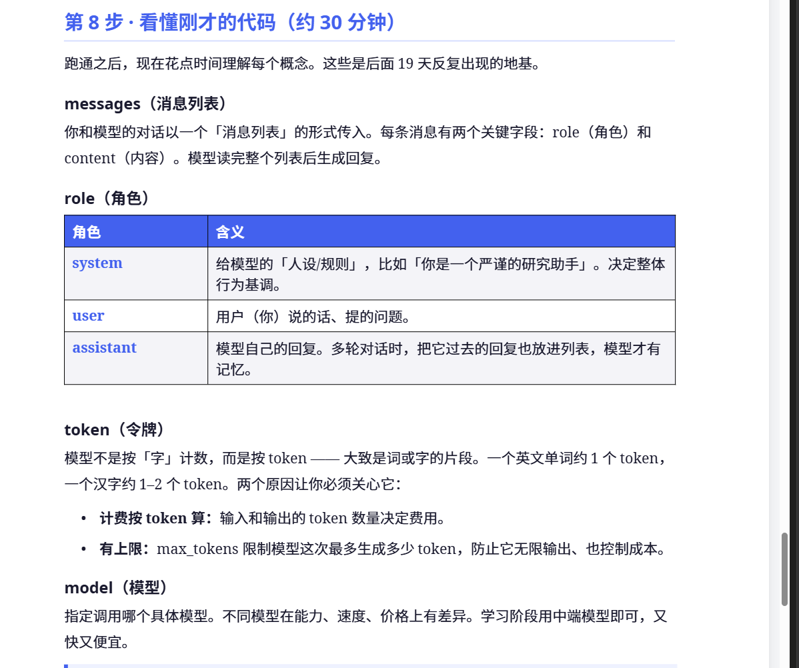

第一步：

创建虚拟环境,在vscode中termnial使用：

python -m venv .venv

接入deepseek大模型的api：

        import os
        from dotenv import load_dotenv
        from openai import OpenAI

        load_dotenv()

        # 关键：指定 DeepSeek 的地址和密钥
        client = OpenAI(
            api_key=os.getenv("DEEPSEEK_API_KEY"),
            base_url="https://api.deepseek.com"
        )

        response = client.chat.completions.create(
            model="deepseek-chat",
            max_tokens=300,
            messages=[
                {"role": "user", "content": "用一句话解释什么是 AI Agent"}
            ],
        )

        print(response.choices[0].message.content)

重点的参数理解：
        